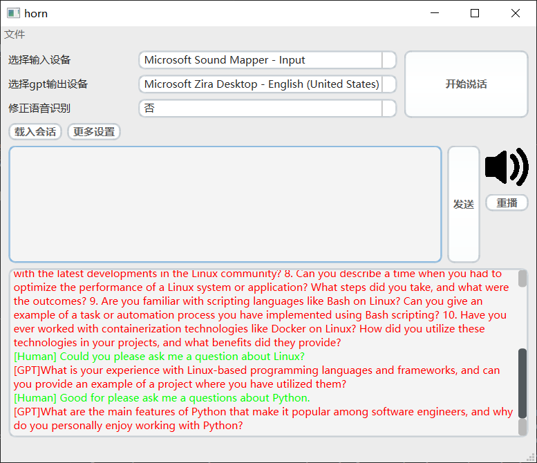

# horn
基于[whisper](https://openai.com/research/whisper)和PyQT(PySide6)的实时GPT聊天工具




## 环境需求

### 显卡

运行`whisper base model`所需显存在1G以下，效果尚可，无杂音、口语准确的情况下准确率能在90%。whisper的`large model`占用显存在8G以上，但是效果非常好，我这糟糕的英语口语都能基本识别对，而且对长语音、断断续续的也有很棒的处理效果。

总体来说，base model比较亲民，但是有条件尽量上large model。对于识别错误的情况，可以在GUI直接修改识别结果。

## 安装

克隆项目

```bash
https://github.com/QureL/horn.git
cd horn
```

创建并激活虚拟环境

```powershell
mkdir venv
python -m venv .\venv\
.\venv\Scripts\Activate.ps1
```

安装依赖

```bash
pip install -r requirements.txt
```

## 运行

在虚拟环境中直接执行

```
python ./main.py
```

